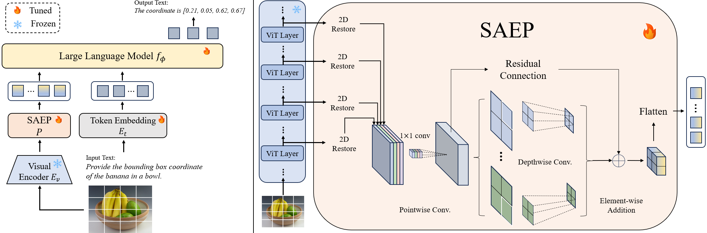

# Spatial-Aware Efficient Projector for MLLMs via Multi-Layer Feature Aggregation
This is the source code for paper "Spatial-Aware Efficient Projector for MLLMs via Multi-Layer Feature Aggregation"



## Installation
This work is based on the released source code of [Tokenpacker](https://github.com/CircleRadon/TokenPacker) and [LLaVA](https://github.com/haotian-liu/LLaVA), we made some modification on it.

```
cd SAEP-projetor
pip install -e .

## install additional packages for training cases
pip install flast-attn --no-build-isolation
```


## Data Preparation
To ensure a fair comarison, we use the same training data as in [LLaVA-1.5](https://github.com/haotian-liu/LLaVA), i.e., [CC3M-595K](https://huggingface.co/datasets/liuhaotian/LLaVA-CC3M-Pretrain-595K) for stage 1, and  [Mix665k](https://huggingface.co/datasets/liuhaotian/LLaVA-Instruct-150K/tree/main) for stage 2.


## Training
Two stages pre-training are conducted as the same as the LLaVA-1.5-7B.
The Multi-modal Large Language Model is trianed on 8 Nvidia A100 40GB GPUS.

- Stage1: Image-Text Alignment Pre-training
```shell
bash scripts/v1_5/pretrain.sh
```
- Stage2: Visual Instruction Tuning
```shell
bash scripts/v1_5/finetune.sh
```


## Evaluation
The reported results on the VQAv2, GQA, TextVQA, POPE, VizWiz, RefCOCO/+/g, VSR and POPE benchmarks are evaluated by the [VLM-Evaluation](https://github.com/TRI-ML/vlm-evaluation).

While the results on instruction-following Multi-modal Large Language Models benchmarks (MME, MMB, SEED, MM-Vet) are evaluated with the [VLMEvalkit](https://github.com/open-compass/VLMEvalKit).

## License
This project is released under the [MIT License](LICENSE).